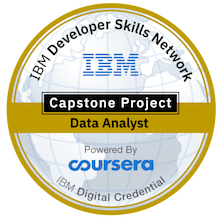
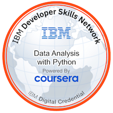
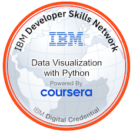
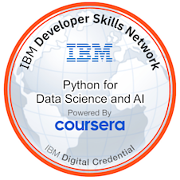
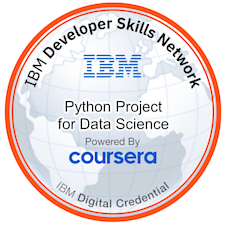
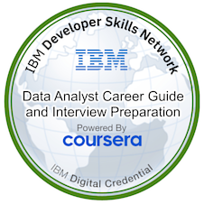

# 👋 Hi there, I'm Carlos!

👨‍💻 **About Me**  
With over 3 years of professional experience as a Java developer, I specialize in maintaining and enhancing legacy applications. My skill set spans various programming languages and frameworks, including:

- 🌐 **Languages & Frameworks**:
  - Java
  - Bash
  - R
  - Python
  - JavaScript
  - TypeScript
  - React
  - Preact
  - Elixir (currently focusing on this and building my portfolio)

🎓 **Education & Certifications**  
I am passionate about continuous learning and have taken various courses to deepen my understanding of these technologies.

- English B2 level

💡 **Open Source & Collaboration**  
I am enthusiastic about contributing to open-source projects and collaborating with fellow developers. I believe in the power of collective effort and shared knowledge.

🛡️ **You can check my credly achievements here:**

[My Badget Wallet on Credly platform](https://www.credly.com/users/carlos-alvaro-rodriguez)

📫 **Get in Touch**  
Feel free to reach out if you want to collaborate on an exciting project or just want to chat about technology!

- [GitHub](https://github.com/Car85)
- Discord account: car85__
- Email: car85@startmail.com

🚀 **Current Focus**  
Lately, I've been diving into the world of Elixir, a dynamic, functional language designed for building scalable and maintainable applications. Check out my first app with elixir https://github.com/Car85/simplechat to see my latest work!

🌟 **Fun Fact**  
When I am not coding, I love exploring new places, reading tech blogs, and trying out new recipes.

